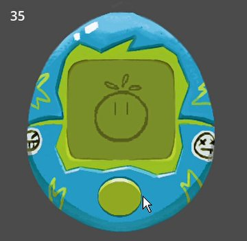

<h1 align="center"> Tamagochi Game </h1>

Simples jogo Tamagochi, de alimentar seu bonequinho quando estiver com fome!

   <a href="#-tecnologias"> Tecnologias </a> &nbsp;&nbsp;&nbsp;|&nbsp;&nbsp;&nbsp;
   <a href="#-projeto"> Projeto</a> &nbsp;&nbsp;&nbsp;|&nbsp;&nbsp;&nbsp;
   <a href="#-tutorial"> Tutorial</a>

  

## 🛠 Tecnologias 

  Projeto desenvolvido com as seguintes tecnologias: 
  - Godot 
  - GDscript 
  - Krita 

## 🎮 Projeto

  Inspirado nos antigos Tamagochi, esse simples jogo tem o objetivo de manter seu boneco vivo o máximo de tempo possível! Não deixe que sua vida chegue a 0 alimentando ele apertando no botão!

## 🎬Tutorial

Este jogo foi desenvolvido graças ao tutorial disponibilizado pelo Estúdio Recursivo neste 
<a href="[Link do Tutorial](https://www.youtube.com/watch?v=yyG2ZRLr5Co)">VÍDEO</a> .

---
    Todas os assets foram feitos por Juãwo e estão disponíveis para uso!
